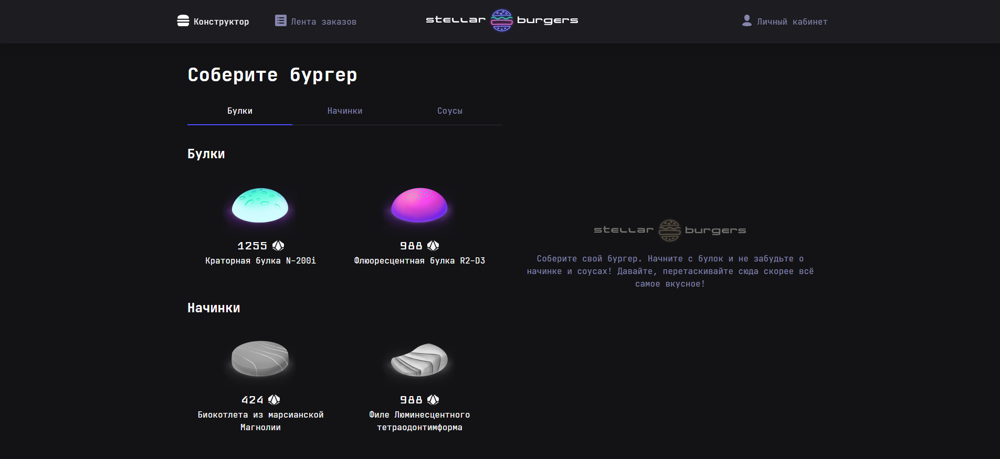
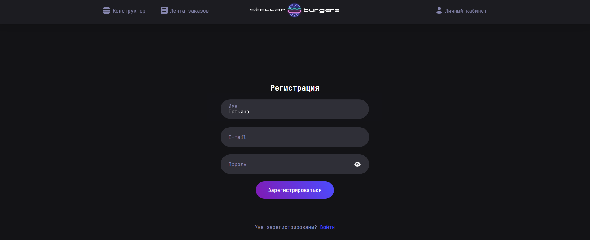
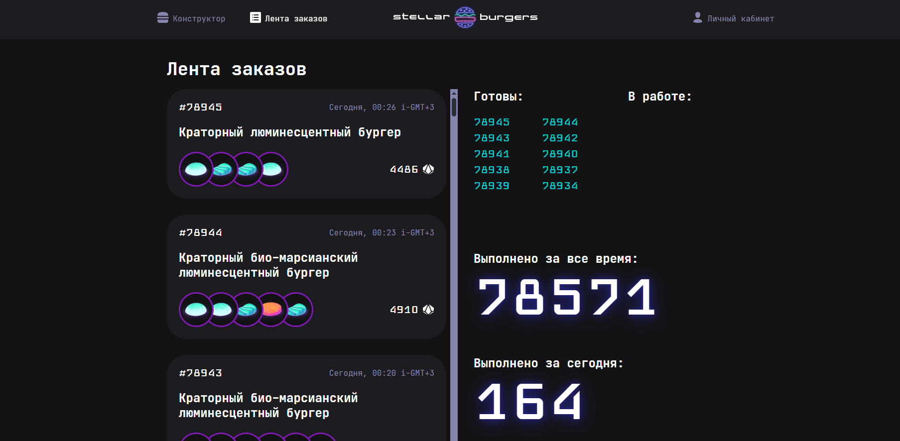
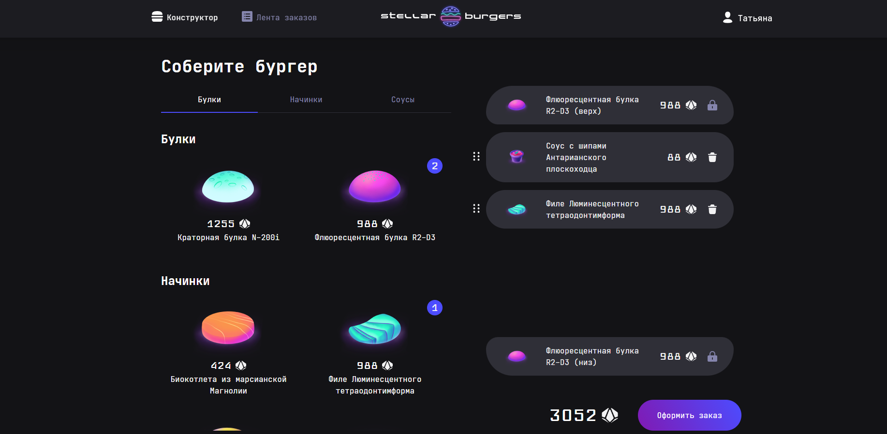
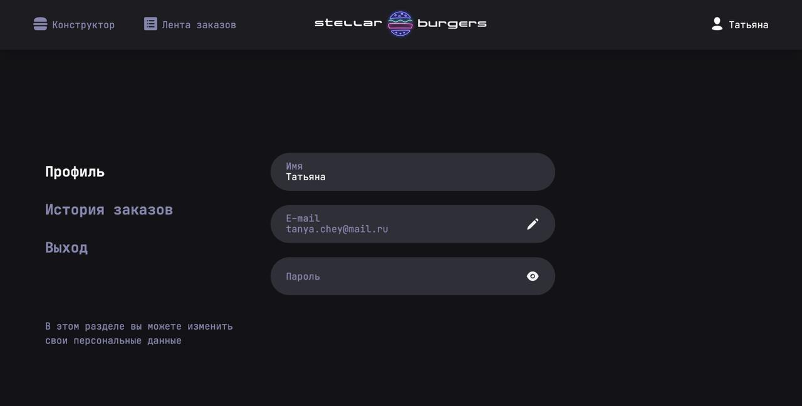
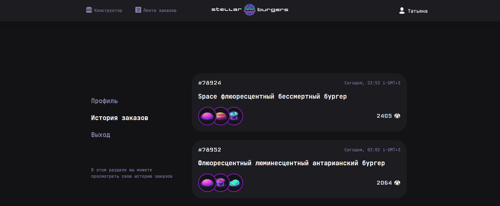
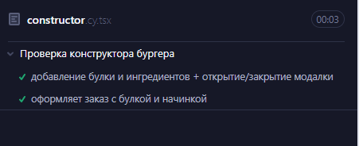

# Stellar Burger

[Проект Stellar Burger](https://github.com/TanyaChey/stellar-burgers)

## Запуск

```
npm install
npm run start
```


## Сборка

```
npm run build
```


## Описание

Сервис по заказу космических бургеров.

Стек: React, SCSS, TS, Webpack, Redux Toolkit

Структура проекта:

- src/ — исходные файлы проекта
- src/components/ — папка с React компонентами

## Функционал
- в проект добавлен роутер и реализованы маршруты в приложении
- добавлено глобавльное состояние с помощью Redux
- реализован механизм авторизации
- дополнительно реализована мобильную версию приложения и валидация форм
- проведены автоматические тесты


## Скриншоты









## Исполнитель

- Github - [Chey Tatiana](https://github.com/TanyaChey)
- Telegram - [Chey Tatiana](https://t.me/TanyaChey)